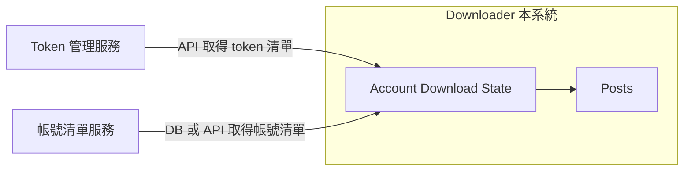

# Threads 公開帳號貼文下載器 — 產品需求文件（PRD）

| 項目 | 說明 |
|------|------|
| 版本 | 0.1 |
| 更新日期 | 2026-03-07 |
| 參考 | [Threads API Rate Limit](Threads_API_rate_limit.md) |

---

## 一、產品目標與範圍

### 目標

針對「有興趣的公開 Threads 帳號」定時抓取貼文，並支援多客戶、大規模帳號清單與下載區間記錄。

### 範圍

- **範圍**：以「公開帳號**貼文**下載」為主。
- **不包含**：
  - 關鍵字搜尋。
  - 私密帳號下的發文、回覆（以及發文/回覆/刪除等寫入能力）。
  - **公開帳號的回覆**：因 Meta Threads API 限制，無法透過 Profile Discovery API 取得；僅在該公開帳號**擁有者**授權 token 給我們時，方可透過「該 token 對應之帳號資料」取得回覆等資料（屬不同產品情境，本產品範圍不涵蓋）。

---

## 二、名詞定義

| 名詞 | 定義 |
|------|------|
| **客戶 (tenant)** | 使用下載服務的一方，有唯一識別（如 `client_id`），擁有獨立的帳號清單、token、下載結果與進度。 |
| **帳號 (account)** | 欲追蹤的公開 Threads 帳號，以 **username** 識別。 |
| **Token** | 用於呼叫 Threads API（如 profile_posts）的授權憑證；每客戶可授權一到多個，不跨客戶共享；限額以單一 token 計算。 |
| **下載區間 / 涵蓋範圍** | 每個「客戶 + 帳號」已下載的貼文時間或 ID 區間（如 last_cursor、latest_downloaded_at、oldest_downloaded_at）。 |
| **Cursor** | API 分頁用游標，用於記錄下次從何處續抓貼文。 |

---

## 三、使用者與多租戶

### 角色

- **客戶 (tenant)**：使用下載服務的一方，每個客戶有獨立的「有興趣的 Threads 帳號清單」（由**帳號清單服務**維護，downloader 不維護）。

### 多客戶

- 每個客戶有唯一識別（如 `client_id`）。
- 下載結果、進度狀態皆以客戶為邊界隔離（資料與權限不可跨客戶存取）。
- **階段與設計策略**：**第一階段僅會有一個客戶**；但設計與實作時**直接以支援多客戶為前提**（資料模型、排程、API 呼叫皆以 client_id 為維度），避免日後擴充多客戶時需大幅改寫。

### 帳號清單

- 由**另一套服務**維護（本 downloader 不維護「有興趣的 Threads 帳號清單」）。
- Downloader 取得每客戶的帳號清單方式二擇一或並存（依部署決定）：**直接存取該服務的 DB**，或**透過該服務的 API** 取得。

### Token 與配額

- 每個客戶授權**一到多個** Threads API token（用於呼叫 profile_posts 等）；Token 僅供該客戶使用，**不跨客戶共享**，故**每客戶每日限額 = 1,000 × 該客戶持有之 token 數**。
- **Token 管理**：由**另一套服務**負責（本 downloader 不實作 token 的發放、撤銷、儲存）。Downloader 透過**呼叫該服務的 API** 取得每個客戶當下授權的 token 清單，再據此進行排程與呼叫 Threads API。

### 可選補充

客戶認證方式、downloader 自有的管理/監控介面需求，可列於後續「介面與整合」規格。

---

## 四、帳號清單規模與行為

### 規模

- 單一客戶的帳號清單可能為**數千～上萬**個公開 Threads 帳號；清單由**帳號清單服務**維護，downloader 僅讀取。

### 取得方式

- Downloader 可能**直接存取帳號清單服務的 DB**，或**透過該服務的 API** 取得清單；實作時可支援其中一種或兩種並存（依部署/環境選擇）。

### 含義

- **本系統儲存**：以「下載狀態、貼文資料」為主；帳號主檔不必然在本系統持久化，而是排程時向帳號清單服務（DB 或 API）查詢。
- **排程**：在「每客戶 1,000 × token 數/日」的限額下，需**每客戶維度**的排程策略（見第六節）。
- **可考慮**：從他服取得之清單的篩選（如僅啟用中帳號）、去重、帳號有效性檢查（profile_lookup 亦為每 token 1,000 次/日，需節制使用）。

---

## 五、下載區間／涵蓋範圍

### 要記錄的內容（每帳號、每客戶）

- **已下載時間或 ID 區間**：例如「最早已下載貼文時間」「最晚已下載貼文時間」或「最新/最舊 post_id 或 cursor」。
- **游標／分頁**：若 API 支援 cursor-based 分頁，記錄每個帳號的 `next_cursor` 或等效狀態，以便下次從該處續抓。

### 首次 vs 增量

- **首次**：全量抓取（從最新往回抓，直到 API 不給或達上限）。
- **增量**：定時只抓「新貼文」（自上次最晚時間或最新 cursor 之後）。

### 資料模型建議

- **帳號識別**：以 **username** 為主（不依賴 profile_lookup 取得 threads-user-id，避免佔用同額度）。
- **本系統持久化**：`Client`（或僅 client_id 參照）、`Post`（原始貼文資料）、`AccountDownloadState`（client_id, username, last_cursor, latest_downloaded_at, oldest_downloaded_at 等）。
- **帳號清單**與**Token 清單**不於本系統維護：帳號清單由排程時向**帳號清單服務**取得（直接讀其 DB 或呼叫其 API），Token 清單由排程時透過**Token 管理服務 API** 取得。

### 架構關係

---

## 六、定時抓取與 API 配額策略

### API 限制摘要（參考 [Threads_API_rate_limit.md](Threads_API_rate_limit.md)）

- **公開帳號貼文**：`GET /profile_posts?username=...`，**24 小時內最多 1,000 次**（Profile Discovery API）；以**單一 token** 計算。
- 僅回傳 18 歲以上且追蹤者 ≥100 的公開帳號；標準存取下僅能查部分官方 Meta 帳號。

### 配額模型

- 限額以**單一 token** 計算；每客戶每日可用次數 = **1,000 × 該客戶授權的 token 數**，且不同客戶的 token 不共享。
- 排程時以**客戶為維度**，在該客戶的 token 池內分配請求（可輪流使用多個 token 以攤提單一 token 的 1,000 次限制）。

### 單一客戶內策略建議

- **輪詢**：在該客戶每日 (1,000 × token 數) 額度內，為其帳號清單排程；若帳號數超過額度，則多日輪完一輪（例如 1 個 token、10,000 帳號 ⇒ 約 10 天輪完一輪；3 個 token 則約 3,000/日，約 3～4 天）。
- **優先順序**：依「上次抓取時間」或客戶自訂優先級，優先抓久未更新的帳號。
- **Token 輪用**：若客戶有多個 token，可輪流使用以分散單一 token 的 1,000 次上限，並可記錄每 token 已用次數（若 API 有提供用量查詢可對齊）。
- **退避與錯誤**：遇到 429 或限流時延後重試、記錄失敗，避免浪費該 token 配額。

### 定時

- 排程（如 cron / 佇列）觸發「抓取任務」；週期可設為每小時/每日等，建議為可配置。

---

## 七、資料儲存與輸出

### 儲存

- 貼文原始回應（JSON 或正規化表）、下載時間、來源帳號、client_id；若需去重，可依 post id 做唯一約束。

### 輸出

- 是否要匯出（CSV/JSON/DB dump）、是否要 Webhook 或通知「新貼文」，可列為進階或 Phase 2（見產品決策區）。

---

## 八、非功能需求

- **擴展性**：帳號清單與貼文筆數可隨時間成長，設計上不假設上限為固定小數字。
- **可觀測性**：紀錄每次呼叫的帳號、時間、成功/失敗、使用配額，方便除錯與合規。
- **安全與合規**：客戶資料隔離、敏感資訊不寫 log、依 Meta 使用條款與資料使用政策使用 API。

---

## 九、假設與不涵蓋範圍

### 假設

- 僅使用「公開帳號 + profile_posts」相關 API；需具備有效 Meta App 與 `threads_profile_discovery` 等權限；網路與服務可用性在合理範圍。
- **Token 管理服務**提供 API 供 downloader 取得每個客戶授權的 token 清單。
- **帳號清單服務**負責維護每客戶的 Threads 帳號清單，downloader 可透過**直接存取該服務的 DB** 或**透過該服務的 API** 取得清單（依實際部署擇一或並存）。

### 不涵蓋

- 關鍵字搜尋；私密帳號貼文與發文；回覆（公開帳號的回覆 API 無法取得，除非該帳號擁有者授權 token，此情境不屬本產品）；發文/回覆/刪除等寫入操作；非 Threads 平台。

---

## 十、產品決策

本節彙整已決策項目與待決策/開放問題，供實作與後續迭代對齊。

### 已決策

| 項目 | 決策內容 |
|------|----------|
| **Rate Limit 計算** | 以**單一 token** 計算；每客戶每日限額 = **1,000 × 該客戶持有之 token 數**；不同客戶的 token 不共享。 |
| **帳號識別** | 以 **username** 為主，不依賴 profile_lookup 取得 threads-user-id，避免佔用同額度。 |
| **Token 管理** | 由另一套服務負責；downloader 透過該服務的 **API** 取得每客戶授權的 token 清單。 |
| **帳號清單** | 由另一套服務維護；downloader 取得方式為**直接存取該服務的 DB** 或**透過該服務的 API**（二擇一或並存，依部署決定）。 |
| **第一階段與設計** | 第一階段僅會有一個客戶；設計與實作時直接以支援多客戶為前提（資料模型、排程、API 皆以 client_id 為維度）。 |

### 待決策 / 開放問題

| 項目 | 說明 |
|------|------|
| **單一客戶內多 token 輪用** | 多 token 時的輪用策略（輪流 vs 並行）、是否追蹤每 token 已用次數；若 Threads API 有提供用量查詢可對齊。 |
| **第一版交付物** | 第一版 downloader 是否需要自有的管理/監控介面（如排程設定、執行狀態、錯誤檢視）？帳號清單與 Token 均由外部服務維護，downloader 透過 DB 或 API 取得帳號清單、透過 API 取得 token 清單。 |
| **輸出與通知** | 是否要匯出（CSV/JSON/DB dump）、是否要 Webhook 或通知「新貼文」；可列為進階或 Phase 2。 |
| **其他** | 客戶認證方式、是否支援多個 Meta App 分散配額等，可於實作前或迭代時定案。 |

---

## 附錄：參考文件

- [Threads API Rate Limit 整理](Threads_API_rate_limit.md) — 應用程式與各端點之 rate limit 說明。
