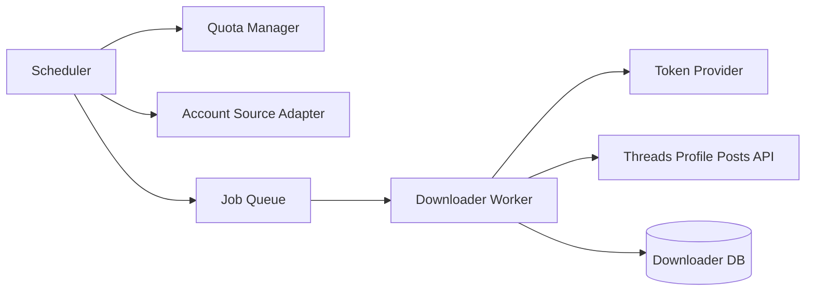

# 技術設計文件（Threads 公開帳號貼文下載器）

## 1. 文件資訊
- 文件名稱：Threads 公開帳號貼文下載器 Technical Design
- 版本：0.1
- 作者：Codex
- 更新日期：2026-03-07
- 狀態：Draft
- 對應 PRD：[PRD.md](PRD.md)
- 相關文件：[Threads_API_rate_limit.md](Threads_API_rate_limit.md)

## 2. 背景與目標
### 2.1 背景
需對大量公開 Threads 帳號進行定時貼文抓取，且第一階段雖僅有單一客戶，仍需以多租戶模式設計，避免後續重構。

### 2.2 產品目標（Goals）
- 依 `client_id` 隔離資料、排程與配額。
- 以 username 為識別抓取 `profile_posts`。
- 支援首次全量與後續增量抓取。
- 可在帳號數遠大於每日配額時持續輪詢。
- 與外部 Token 服務、帳號清單服務整合（API/DB）。

### 2.3 不在範圍（Non-Goals）
- 關鍵字搜尋。
- 私密帳號資料與任何寫入操作（發文/回覆/刪除）。
- 公開帳號回覆抓取（需帳號擁有者 token 的其他產品情境）。

## 3. 需求對應
### 3.1 功能需求對應（PRD -> 設計）
| PRD 條目 | 設計對應 | 實作模組 | 驗收方式 |
|---|---|---|---|
| 多租戶隔離 | 所有主表以 `client_id` 為 partition key | Scheduler, Repository | 任一查詢皆需帶 `client_id`；跨客戶查詢為 0 |
| 帳號清單外部維護 | AccountSource Adapter（API/DB 雙實作） | account_source | 可切換來源且結果一致 |
| Token 外部管理 | TokenProvider Adapter（僅 API） | token_provider | 每輪任務都可取得最新 token 池 |
| 首次/增量抓取 | `AccountDownloadState` 管理 cursor + 時間邊界 | downloader_worker | 首次可回填歷史、增量僅抓新文 |
| 配額控制 | 每 token 24h 1,000 次，客戶池化輪用 | quota_manager, scheduler | 不中斷超額；429 可退避 |

### 3.2 非功能需求對應
| 類別 | 需求 | 設計策略 | 指標/門檻 |
|---|---|---|---|
| 可用性 | 長時間穩定抓取 | 佇列化 + 重試 + dead-letter | 任務成功率 > 99%（排除外部 4xx） |
| 擴展性 | 千～萬帳號 | 分批拉單、分頁抓取、水平擴 worker | 單客戶可配置 >10k 帳號 |
| 可觀測性 | 可追查失敗與配額 | 結構化日誌 + 指標 + trace id | 每次 API 呼叫可追蹤 |
| 安全合規 | 租戶隔離、敏感資訊保護 | token 不落庫明文；log 遮罩 | 無 token 洩漏 |

## 4. 系統架構
### 4.1 架構概覽
- Scheduler：按週期掃描客戶並產生抓取任務。
- Worker：執行抓取、分頁、寫入貼文、更新狀態。
- Quota Manager：追蹤每客戶 token 用量，分配 token。
- Repositories：儲存 `Post` 與 `AccountDownloadState`。
- External Integrations：Token Service、Account List Service、Threads API。

### 4.2 元件責任
| 元件 | 責任 | 輸入 | 輸出 |
|---|---|---|---|
| Scheduler | 依配額產生 account 抓取任務 | client 列表、token 池、account 清單 | queue jobs |
| Downloader Worker | 拉取貼文並更新狀態 | job(client_id, username) | posts、state update |
| Quota Manager | token 輪用與上限控管 | token 列表、使用紀錄 | 可用 token |
| Account Source Adapter | 取得目標帳號清單 | client_id | usernames |
| Token Provider | 取得客戶 token 清單 | client_id | token 池 |

### 4.3 關鍵流程
- 首次全量流程：無狀態帳號 -> 從最新開始反向分頁直到無下一頁或達輪次預算 -> 記錄最舊/最新時間與 cursor。
- 增量流程：已有狀態帳號 -> 以 `latest_downloaded_at` 或 cursor 作為邊界抓新貼文 -> 更新 latest 與 cursor。
- 重試/補償流程：5xx/網路錯誤重試；429 退避並換 token；連續失敗入 dead-letter 後人工或定時重放。

## 5. 資料設計
### 5.1 資料模型
| Entity/Table | 主鍵 | 重要欄位 | 說明 |
|---|---|---|---|
| posts | (`client_id`,`username`,`post_id`) | posted_at, payload_json, downloaded_at | 原始貼文與去重 |
| account_download_state | (`client_id`,`username`) | last_cursor, latest_downloaded_at, oldest_downloaded_at, last_success_at, last_error | 每帳號下載進度 |
| token_usage_daily | (`client_id`,`token_hash`,`window_start`) | used_count, exhausted_at | 每 token 每 24h 用量（本地估算） |
| download_run_log | run_id | client_id, username, token_hash, status, error_code, latency_ms | 稽核與除錯 |

### 5.2 關聯與索引
- `posts(client_id, username, posted_at desc)`：增量查詢與對帳。
- `account_download_state(client_id, last_success_at)`：排程優先級。
- `token_usage_daily(client_id, window_start)`：配額計算。

### 5.3 資料生命週期
- 寫入策略：API 回應先落 `posts`（upsert），再更新 `account_download_state`（同交易）。
- 去重策略：`(client_id, username, post_id)` 唯一鍵。
- 保留策略：Phase 1 不刪；Phase 2 可加 TTL/冷儲存。

## 6. 介面與整合
### 6.1 外部服務整合
| 服務 | 方式（API/DB） | 呼叫時機 | 失敗處理 |
|---|---|---|---|
| Token 管理服務 | API | 每個排程批次開始與 token 失效時 | 快取上次成功清單 + 告警 |
| 帳號清單服務 | API 或 DB | 每次排程切片前 | 失敗則跳過該 client 本輪並告警 |
| Threads API | API | 每個抓取 job | 分類重試、429 退避 |

### 6.2 API 契約（本系統對外）
| Method | Path | 用途 | 主要輸入 | 主要輸出 |
|---|---|---|---|---|
| POST | `/internal/runs/trigger` | 手動觸發某 client 排程 | client_id | run_id |
| GET | `/internal/runs/{run_id}` | 查詢執行狀態 | run_id | 狀態、統計 |
| GET | `/internal/clients/{client_id}/accounts/{username}/state` | 查帳號進度 | client_id, username | cursor, latest/oldest |

## 7. 排程與配額策略
### 7.1 排程模型
- 每小時觸發一次，對每個 `client_id` 獨立計算本輪 budget。
- 本輪 budget = `min(剩餘日配額, 本輪上限)`。
- 依 `last_success_at`（最久未抓優先）選取帳號，產生 job。

### 7.2 Rate Limit 控制
- 每 token 視窗 24h 上限 1,000 次。
- 客戶總上限：`token_count * 1000`。
- token 分配策略：Round-robin + 跳過 exhausted token。
- 遇 429：標記 token 暫停（cooldown），改派下一個 token。

### 7.3 優先級與公平性
- 客戶間公平：每 client 獨立排程，不互搶 token。
- 客戶內公平：帳號採 aging（久未抓者優先）+ fail penalty（連錯降權）。

## 8. 錯誤處理與韌性
- 錯誤分類：可重試（超時、5xx、429）/不可重試（4xx 無效參數、帳號不存在）。
- 重試策略：指數退避（1m, 5m, 15m）最多 3 次。
- 退避策略：429 觸發 token cooldown 30~60 分鐘可配置。
- 死信/人工介入：超過重試次數進 dead-letter，提供 run_id 與錯誤碼。

## 9. 可觀測性
- 指標（Metrics）：`jobs_total`, `jobs_failed_total`, `threads_api_calls_total`, `token_usage_ratio`, `lag_hours`。
- 日誌（Logging）：結構化欄位 `client_id`, `username`, `token_hash`, `run_id`, `status`。
- 追蹤（Tracing）：job 與 API call 使用同一 correlation id。
- 告警（Alerting）：client 連續失敗、token 全 exhausted、積壓 job 過高。

## 10. 安全與合規
- 身分與授權：內部 API 僅服務間存取（mTLS 或 service token）。
- 租戶隔離：所有查詢必帶 `client_id` 條件。
- 敏感資訊保護：token 僅記憶體使用；若需落庫僅存 hash/fingerprint。
- 法規/平台條款：遵循 Meta Threads API 使用條款與 scope 限制。

## 11. 實作計畫
### 11.1 里程碑
| Phase | 內容 | 產出 | 預估 |
|---|---|---|---|
| 1 | 核心抓取 + 多租戶資料模型 + API 整合 | 可定時抓取與增量更新 | 2 週 |
| 2 | 監控告警 + dead-letter + 手動重放 | 可運維、可追查 | 1 週 |
| 3 | 匯出/通知（可選） | CSV/JSON/Webhook | 1 週 |

### 11.2 任務拆分
- 建立 DB schema 與 migration。
- 實作 TokenProvider/AccountSource adapters。
- 實作 Scheduler + Quota Manager。
- 實作 Downloader Worker（首次/增量/分頁/去重）。
- 實作 observability 與 internal APIs。
- 撰寫整合測試與壓測場景。

### 11.3 風險與緩解
| 風險 | 影響 | 緩解 |
|---|---|---|
| Threads API 行為/回傳變動 | 抓取中斷 | contract test + feature flag |
| token 大量失效 | 大面積停擺 | token 即時刷新 + fallback token 池 |
| 帳號量爆增 | 延遲上升 | 水平擴 worker + 分區排程 |

## 12. 測試與驗收
### 12.1 測試策略
- Unit：配額計算、token 輪用、cursor 邊界。
- Integration：外部服務 adapter、DB transaction、API 錯誤處理。
- E2E：模擬 1 client/10k 帳號、1~3 token 的輪詢與多日覆蓋。

### 12.2 驗收標準（DoD）
- 可對指定 `client_id` 完成首次全量與後續增量。
- 429/5xx 錯誤下仍可恢復並持續抓取。
- 每客戶資料完整隔離，且不跨租戶 token。
- 指標與日誌可定位任一失敗任務。

## 13. 開放問題與假設

### 13.1 多 Token 在單客戶上（假設與官方依據）

**假設一：每個 token 個別計算 rate limit**

- 依據 [Threads API Overview](https://developers.facebook.com/docs/threads/overview)：「Calls to the Threads API are counted against the calling app's call count. **An app's call count is unique for each app and app user pair**」— 即以「應用程式 × 使用者」為單位，**每個 token（每個 app user）有獨立的呼叫計數**。
- 依據 [Retrieve User Posts - Profile Discovery](https://developers.facebook.com/docs/threads/retrieve-and-discover-posts/retrieve-posts)（`GET /profile_posts?username=...`）：「**A user** can send a maximum of 1,000 requests within a rolling 24-hour period」— **1,000 次/24h 為「每個使用者」**，亦即每個 token 各自擁有 1,000 次/日的額度。
- **結論**：多 token 時，客戶總配額 = 1,000 × 該客戶可用 token 數；各 token 限額獨立、可並行使用以加總吞吐量。

**假設二：單客戶的 token 池可能動態變動**

- Token 可能**失效**（過期、撤銷、權限變更）。
- **新 token** 可能隨時加入（新用戶授權）。
- 設計上需：每輪排程或任務前取得**最新** token 清單；配額與輪用邏輯以「當下可用 token」為準，不假設固定數量。

### 13.2 最大化 Rate Limit 的建議（抓取量／追蹤帳號數）

在「每個 token 獨立 1,000/日」且「token 池動態」前提下，若要**最大化每日可抓取貼文數或可追蹤的 public profile 數**，建議如下：

| 策略 | 說明 |
|------|------|
| **每輪取得最新 token 清單** | 每次排程或批次開始前，向 Token 服務取得該客戶當前授權 token 清單；失效或新增即時反映，避免用已撤銷 token 或漏用新 token。 |
| **用滿所有可用 token 的額度** | 客戶日總額 = 1,000 × 當下可用 token 數。配額分配與 job 數量應以「所有 token 的總額度」為上界，避免只集中用少數 token。 |
| **每 token 獨立追蹤用量** | 以 `token_usage_daily`（或等效）追蹤每個 token 在滾動 24h 內的已用次數；達 1,000 即標記 exhausted、本日不再派發；新加入的 token 從 0 開始計。 |
| **Round-robin 或並行派發** | **Round-robin**：依序將請求派給不同 token，使各 token 用量平均、總體不浪費額度。**並行**：若實作允許，可對多個 token 同時發請求（例如每 token 一 worker 或一併發串流），在總額度內最大化吞吐。 |
| **429 / token 錯誤時換 token** | 遇 429 或 token 無效（401/403）時，標記該 token 暫停（cooldown）或移除，改派下一個可用 token；必要時本輪結束後重新拉取 token 清單。 |
| **動態 token 不重複計入已用額度** | 若某 token 中途失效或自清單移除，其「已用次數」不應攤到其他 token；新加入的 token 擁有完整 1,000 次額度，不因其他 token 已用滿而受限。 |
| **優先久未抓取的帳號** | 在額度有限下，依 `last_success_at` 排序，優先抓取最久未更新的帳號，使輪詢覆蓋率與公平性最佳。 |

實作上可採：**Quota Manager 依「當前 token 清單」與「每 token 已用次數」決定本輪 budget；Scheduler 依 budget 產生 job；Worker 取 token 時由 Quota Manager 回傳未 exhausted 的 token（round-robin 或並行池），以達最大化利用。

### 13.3 其他開放問題

- 多 token 在單客戶內是純 round-robin 或可並行、並行上限多少？（建議見 13.2。）
- 第一版是否需要管理 UI（排程調整、錯誤檢視）？
- Phase 2 的輸出優先順序（Webhook vs 檔案匯出）？
- 是否需要支援多 Meta App 以分散配額？

## 14. 附錄
- 術語表：tenant/client、account/username、cursor、incremental sync。
- 參考連結：[PRD.md](PRD.md)、[Threads_API_rate_limit.md](Threads_API_rate_limit.md)。
- 官方文件（Rate Limit 依據）：[Threads API Overview](https://developers.facebook.com/docs/threads/overview)、[Retrieve User Posts (profile_posts)](https://developers.facebook.com/docs/threads/retrieve-and-discover-posts/retrieve-posts)。
