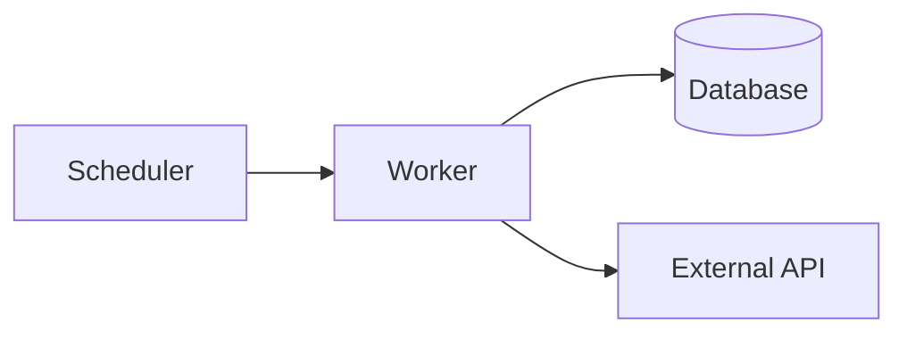

# 技術設計文件範本（Technical Design Template）

> 用途：將 PRD 轉成可實作、可驗收、可演進的工程設計文件。

## 1. 文件資訊
- 文件名稱：
- 版本：
- 作者：
- 更新日期：
- 狀態：Draft / Review / Approved / Implemented
- 對應 PRD：
- 相關文件：

## 2. 背景與目標
### 2.1 背景
- 

### 2.2 產品目標（Goals）
- 

### 2.3 不在範圍（Non-Goals）
- 

## 3. 需求對應
### 3.1 功能需求對應（PRD -> 設計）
| PRD 條目 | 設計對應 | 實作模組 | 驗收方式 |
|---|---|---|---|
|  |  |  |  |

### 3.2 非功能需求對應
| 類別 | 需求 | 設計策略 | 指標/門檻 |
|---|---|---|---|
| 可用性 |  |  |  |
| 擴展性 |  |  |  |
| 可觀測性 |  |  |  |
| 安全合規 |  |  |  |

## 4. 系統架構
### 4.1 架構概覽
- 主要元件：
- 外部依賴：
- 資料流：

### 4.2 元件責任
| 元件 | 責任 | 輸入 | 輸出 |
|---|---|---|---|
|  |  |  |  |

### 4.3 關鍵流程
- 首次全量流程：
- 增量流程：
- 重試/補償流程：

## 5. 資料設計
### 5.1 資料模型
| Entity/Table | 主鍵 | 重要欄位 | 說明 |
|---|---|---|---|
|  |  |  |  |

### 5.2 關聯與索引
- 

### 5.3 資料生命週期
- 寫入策略：
- 去重策略：
- 保留策略：

## 6. 介面與整合
### 6.1 外部服務整合
| 服務 | 方式（API/DB） | 呼叫時機 | 失敗處理 |
|---|---|---|---|
|  |  |  |  |

### 6.2 API 契約（本系統對外）
| Method | Path | 用途 | 主要輸入 | 主要輸出 |
|---|---|---|---|---|
|  |  |  |  |  |

## 7. 排程與配額策略
### 7.1 排程模型
- 

### 7.2 Rate Limit 控制
- 

### 7.3 優先級與公平性
- 

## 8. 錯誤處理與韌性
- 錯誤分類：
- 重試策略：
- 退避策略：
- 死信/人工介入：

## 9. 可觀測性
- 指標（Metrics）：
- 日誌（Logging）：
- 追蹤（Tracing）：
- 告警（Alerting）：

## 10. 安全與合規
- 身分與授權：
- 租戶隔離：
- 敏感資訊保護：
- 法規/平台條款：

## 11. 實作計畫
### 11.1 里程碑
| Phase | 內容 | 產出 | 預估 |
|---|---|---|---|
| 1 |  |  |  |

### 11.2 任務拆分
- 

### 11.3 風險與緩解
| 風險 | 影響 | 緩解 |
|---|---|---|
|  |  |  |

## 12. 測試與驗收
### 12.1 測試策略
- Unit：
- Integration：
- E2E：

### 12.2 驗收標準（DoD）
- 

## 13. 開放問題
- 

## 14. 附錄
- 術語表：
- 參考連結：
